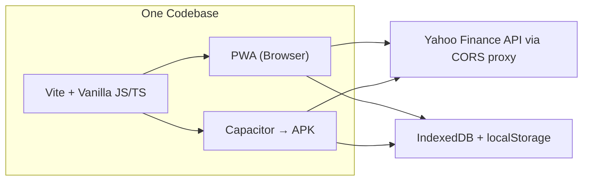
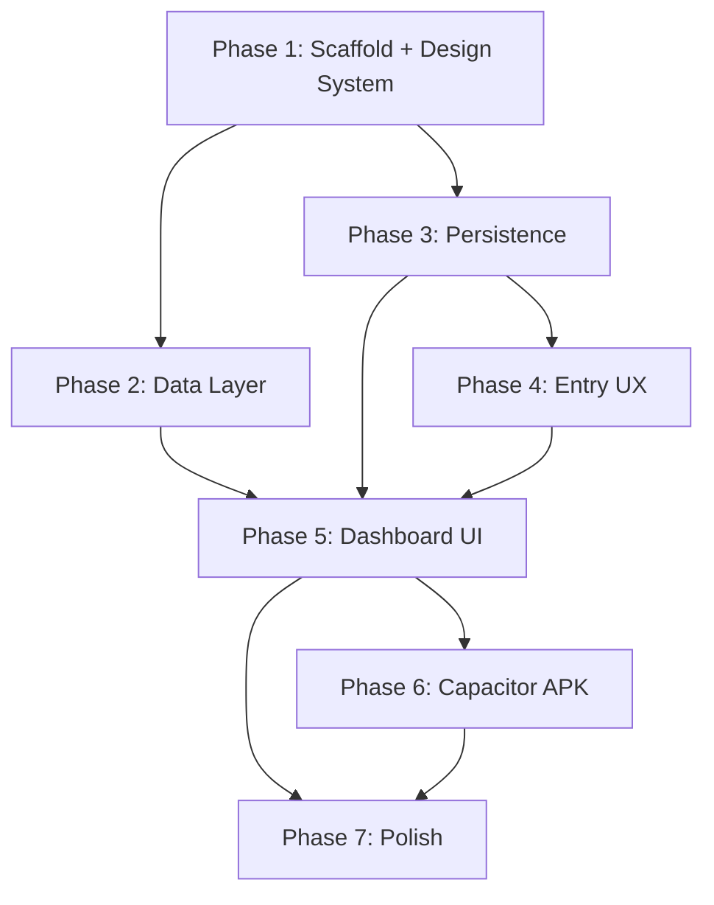

# TrackIndexes — Revised Build Plan (PWA + Capacitor)

> **App:** A PWA that displays near-realtime NIFTY 50 & SENSEX data, with login-free persistence, local autosave, and optional file export/import. Wrapped as an Android APK via Capacitor.

Sources: [designNote.md](file:///home/subbu/Downloads/Projects/81TrackIndexes/designNote.md) · [LoginFreePersist.md](file:///home/subbu/Downloads/Projects/81TrackIndexes/LoginFreePersist.md) · [future.md](file:///home/subbu/Downloads/Projects/81TrackIndexes/future.md)

---

## Architecture Overview

**Stack:** Vite · Vanilla JS (no framework) · CSS · PWA APIs · Capacitor 6

**Why no framework:** Two index cards, a decision screen, and a settings sheet. React/Vue would be overhead. Vanilla JS with Vite gives fast HMR, tree-shaking, and near-zero bundle size.

---

## Phase 1 — Project Scaffold & Design System

Set up the Vite project, PWA manifest, folder structure, and visual foundation.

### Task 1.1 — Project Init

| # | Atomic Task | Done Condition |
|---|-------------|----------------|
| 1.1.1 | `npm create vite@latest ./ -- --template vanilla` in project root | `npm run dev` serves blank page |
| 1.1.2 | Add folder structure: `src/{services, models, screens, components, utils, assets}` | Empty dirs exist |
| 1.1.3 | Add dev dependencies: `vite-plugin-pwa` | `npm install` succeeds |
| 1.1.4 | Configure `vite.config.js` with PWA plugin, manifest, and service worker (auto-register) | `npm run build` generates `sw.js` |

### Task 1.2 — PWA Manifest & Icons

| # | Atomic Task | Done Condition |
|---|-------------|----------------|
| 1.2.1 | Create `manifest.json`: name, short_name, theme_color, background_color, display: standalone, start_url | Valid manifest in devtools |
| 1.2.2 | Generate app icons (192×192, 512×512) | Icons referenced in manifest |
| 1.2.3 | Add `<meta>` tags in `index.html`: viewport, theme-color, apple-mobile-web-app-capable | PWA installable on Chrome |

### Task 1.3 — Design System (CSS)

| # | Atomic Task | Done Condition |
|---|-------------|----------------|
| 1.3.1 | Create `src/styles/tokens.css` — CSS custom properties: colors (dark palette), spacing scale, radii, shadows, transitions | Token file importable |
| 1.3.2 | Create `src/styles/base.css` — reset, body defaults, typography (Inter from Google Fonts), scrollbar styling | Clean baseline rendering |
| 1.3.3 | Create `src/styles/components.css` — card, button, badge, input, bottom-sheet utility classes | Reusable component styles |
| 1.3.4 | Dark theme as default, light theme via `[data-theme="light"]` on `<html>` | Toggle works |

---

## Phase 2 — Data Layer (Index Fetching)

Fetch NIFTY 50 and SENSEX quotes from Yahoo Finance.

### Task 2.1 — Models

| # | Atomic Task | Done Condition |
|---|-------------|----------------|
| 2.1.1 | Create `src/models/IndexQuote.js` — class/factory: `symbol`, `name`, `price`, `change`, `changePercent`, `timestamp`, `isDelayed` | Importable, serializable |

### Task 2.2 — Yahoo Finance Service

| # | Atomic Task | Done Condition |
|---|-------------|----------------|
| 2.2.1 | Create `src/services/yahooFinance.js` — `fetchQuote(symbol)` function | Returns parsed `IndexQuote` |
| 2.2.2 | URL builder: `https://corsproxy.io/?https://query1.finance.yahoo.com/v8/finance/chart/{encodedSymbol}?interval=1d&range=1d` | Correct URL encoding for `^NSEI`, `^BSESN` |
| 2.2.3 | Response parser: extract `chart.result[0].meta.regularMarketPrice`, `.regularMarketChange`, `.regularMarketChangePercent` | Returns `IndexQuote` or throws |
| 2.2.4 | Error handling: network timeout (8s), HTTP errors, malformed JSON, missing fields | Throws typed errors with user-friendly messages |

### Task 2.3 — Polling Controller

| # | Atomic Task | Done Condition |
|---|-------------|----------------|
| 2.3.1 | Create `src/services/pollController.js` — polls both indices every 60s, emits via custom `EventTarget` / callback | Subscribers receive `[niftyQuote, sensexQuote]` |
| 2.3.2 | Rate-limit guard: enforce minimum 60s between fetches (per `designNote.md`) | Double-trigger within 60s is no-op |
| 2.3.3 | Expose `start()`, `stop()`, `forceRefresh()` | Manual refresh respects rate limit |
| 2.3.4 | Handle offline: detect `navigator.onLine`, pause polling, resume on reconnect | Online/offline events handled |

---

## Phase 3 — Persistence Layer (Login-Free)

Implements the full design from `LoginFreePersist.md` using native browser APIs.

### Task 3A — State Model & Local Storage

| # | Atomic Task | Done Condition |
|---|-------------|----------------|
| 3A.1 | Define workspace state schema (v1): `{ version, lastUpdatedAt, preferences: { theme, refreshInterval }, lastQuotes: [...], viewConfig }` | Documented in code |
| 3A.2 | Create `src/services/localStore.js` — wraps IndexedDB via a thin helper (or `idb-keyval` package) for full workspace read/write | `save(workspace)`, `load()`, `clear()` |
| 3A.3 | Store metadata in `localStorage`: `{ hasWorkspace: bool, lastSaved: ISO string, stateVersion: int }` | Fast cold-start detection without opening IDB |
| 3A.4 | Create `src/services/autosave.js` — debounced save (2s idle) triggered on state mutation | Autosave fires on preference change, new quote data |

### Task 3B — Export Service

| # | Atomic Task | Done Condition |
|---|-------------|----------------|
| 3B.1 | Create `src/services/exportService.js` — serializes workspace into versioned JSON envelope: `{ version, exportedAt, app: "trackindexes", workspace }` | Returns JSON string |
| 3B.2 | Trigger browser download with filename `trackindexes-backup-YYYY-MM-DD.json` | File downloads on click |

### Task 3C — Import Service

| # | Atomic Task | Done Condition |
|---|-------------|----------------|
| 3C.1 | Create `src/services/importService.js` — `importFromFile(file)`: parse JSON, validate structure | Returns parsed workspace or error |
| 3C.2 | Validation checks: valid JSON → top-level fields exist → `app === "trackindexes"` → version is recognized → required workspace fields present | Each check has specific error message |
| 3C.3 | Create `src/services/migrationRunner.js` — sequential version upgrades: v1→v2→…→current | Tested with mock v1 data |
| 3C.4 | On import success: show confirmation dialog with summary (date, version), then **replace** local workspace | User confirms before replace |

### Task 3D — Sanitization & Security

| # | Atomic Task | Done Condition |
|---|-------------|----------------|
| 3D.1 | Sanitize all imported string fields before rendering (prevent XSS from crafted JSON) | No raw `innerHTML` from imported data |
| 3D.2 | Reject files > 1 MB (sanity limit for this app's state size) | Error message for oversized files |
| 3D.3 | Never trust imported data for authorization (no admin flags, no quota fields in schema) | Schema enforced |

---

## Phase 4 — Entry / Resume UX

The "Resume or Start Afresh" decision screen from `LoginFreePersist.md`.

### Task 4.1 — Entry Screen

| # | Atomic Task | Done Condition |
|---|-------------|----------------|
| 4.1.1 | Create `src/screens/entryScreen.js` — on app load, check `localStorage` for `hasWorkspace` | Fast check, no IDB read yet |
| 4.1.2 | **No saved state** → auto-initialize empty workspace → navigate to dashboard | Seamless first visit |
| 4.1.3 | **Saved state exists** → render decision card with app branding | Card visible |
| 4.1.4 | Card copy: "We found saved progress on this device." + "Last saved on {formatted date}" | Timestamp formatted with `Intl.DateTimeFormat` |
| 4.1.5 | **Resume** button (primary) → load workspace from IndexedDB → navigate to dashboard | Works with valid saved data |
| 4.1.6 | **Start afresh** button (destructive) → confirmation modal ("This will clear all saved progress. Continue?") → clear IDB + localStorage → init fresh → dashboard | Confirmation required |
| 4.1.7 | **Import from file** link (secondary) → file picker → `importService` → on success → dashboard | Wired to Phase 3C |

### Task 4.2 — Screen Router

| # | Atomic Task | Done Condition |
|---|-------------|----------------|
| 4.2.1 | Create `src/router.js` — simple hash-based or state-driven screen switcher (entry ↔ dashboard) | `showScreen('entry')`, `showScreen('dashboard')` |
| 4.2.2 | Handle back button / history so refreshing the dashboard doesn't re-show entry screen (if already resumed) | `history.replaceState` |

---

## Phase 5 — Dashboard UI

The primary screen displaying live NIFTY 50 and SENSEX data.

### Task 5.1 — Layout & App Shell

| # | Atomic Task | Done Condition |
|---|-------------|----------------|
| 5.1.1 | Create `src/screens/dashboardScreen.js` — app bar with title "TrackIndexes", overflow menu icon | Renders app shell |
| 5.1.2 | Main content area: vertically stacked index cards with spacing | Responsive, centered layout |
| 5.1.3 | Pull-to-refresh gesture (or visible refresh button + pull on mobile) | Triggers `pollController.forceRefresh()` |
| 5.1.4 | Footer bar: "Updated 12:30 PM · ~15 min delayed" | Timestamp from last successful fetch |

### Task 5.2 — Index Card Component

| # | Atomic Task | Done Condition |
|---|-------------|----------------|
| 5.2.1 | Create `src/components/indexCard.js` — displays: index name, current price (large), change value, change % | Card renders with mock data |
| 5.2.2 | Color coding: green for positive change, red for negative, with background tint | Visual distinction clear |
| 5.2.3 | Subtle up/down arrow icon next to change value | Directional indicator |
| 5.2.4 | "~15 min delayed" badge on each card | Badge styled as pill |
| 5.2.5 | Loading state: shimmer/skeleton placeholder matching card dimensions | Shown during first fetch |
| 5.2.6 | Error state: friendly message + retry button inside card area | "Couldn't fetch data. Tap to retry." |
| 5.2.7 | Micro-animation: price update pulse/flash on new data | CSS transition on value change |

### Task 5.3 — Settings / Actions Menu

| # | Atomic Task | Done Condition |
|---|-------------|----------------|
| 5.3.1 | Create `src/components/settingsSheet.js` — bottom sheet / dropdown with action list | Opens on menu icon tap |
| 5.3.2 | **Theme toggle** — switch dark/light, save to workspace preferences | Persisted via autosave |
| 5.3.3 | **Download backup** — triggers `exportService` | File downloads |
| 5.3.4 | **Import from file** — triggers file picker + `importService` → refreshes dashboard | State replaced, UI updated |
| 5.3.5 | **Reset progress** — confirmation → clears workspace → redirects to entry screen | Destructive with confirmation |
| 5.3.6 | **About** — app version, data source attribution ("Data from Yahoo Finance, ~15 min delayed") | Info dialog |

---

## Phase 6 — Capacitor + APK

Wrap the PWA as a native Android app.

### Task 6.1 — Capacitor Setup

| # | Atomic Task | Done Condition |
|---|-------------|----------------|
| 6.1.1 | `npm install @capacitor/core @capacitor/cli` | Packages installed |
| 6.1.2 | `npx cap init "TrackIndexes" "com.trackindexes.app" --web-dir dist` | `capacitor.config.ts` generated |
| 6.1.3 | `npm install @capacitor/android` + `npx cap add android` | `android/` directory created |
| 6.1.4 | Configure `capacitor.config.ts`: `server.androidScheme: 'https'`, `webDir: 'dist'` | Config valid |

### Task 6.2 — Android Customization

| # | Atomic Task | Done Condition |
|---|-------------|----------------|
| 6.2.1 | Set app icon in `android/app/src/main/res/mipmap-*` | Custom icon shows on launcher |
| 6.2.2 | Set splash screen color to match app theme | Branded launch |
| 6.2.3 | Set `minSdkVersion` to 22 in `android/app/build.gradle` | Covers 95%+ devices |
| 6.2.4 | Verify internet permission in `AndroidManifest.xml` | `INTERNET` permission present |

### Task 6.3 — Build & Test

| # | Atomic Task | Done Condition |
|---|-------------|----------------|
| 6.3.1 | `npm run build` → `npx cap sync` → `npx cap open android` | Android Studio opens project |
| 6.3.2 | Build debug APK: `cd android && ./gradlew assembleDebug` | APK generated, < 10 MB |
| 6.3.3 | Install on device/emulator, verify all features work inside WebView | Full lifecycle test passes |
| 6.3.4 | Test IndexedDB persistence survives app kill and reopen | Data persists |
| 6.3.5 | Build release APK: `./gradlew assembleRelease` | Signed APK ready |

---

## Phase 7 — Polish & Hardening

| # | Atomic Task | Done Condition |
|---|-------------|----------------|
| 7.1 | Offline handling: show last-cached quotes with "Offline" badge, hide refresh | Graceful offline UX |
| 7.2 | Service worker caches app shell for instant PWA loads | Works offline (app shell) |
| 7.3 | Add `<meta>` SEO tags, Open Graph tags for web version | Shareable link preview |
| 7.4 | Accessibility pass: ARIA labels on cards, buttons; keyboard navigation; sufficient contrast ratios | a11y audit passes |
| 7.5 | Test edge cases: corrupt localStorage, IDB cleared by OS, import of v1 file on v3 app | Graceful error handling |
| 7.6 | Performance: Lighthouse PWA audit score ≥ 90 | Audit passes |
| 7.7 | Write `README.md`: setup, dev, build, Capacitor commands, architecture | Documentation complete |

---

## Dependency Graph

- **Phases 2 and 3** can be built in **parallel** after Phase 1
- **Phase 5** is the merge point — needs both data and persistence
- **Phase 6** (Capacitor) runs after the web app is feature-complete

---

## Verification Plan

### Automated
- Lighthouse PWA audit ≥ 90
- `npm run build` produces clean output, no warnings
- Service worker registers and caches app shell

### Manual Testing Matrix

| Scenario | Expected Result |
|----------|----------------|
| First visit (browser) | Empty workspace, auto-init, dashboard loads |
| Return visit (browser) | Decision screen with timestamp |
| Resume → kill → reopen | Data persists via IndexedDB |
| Export → clear storage → import | Full state restored |
| Import corrupt/wrong file | Specific error message per failure type |
| Airplane mode | Last known values + "Offline" badge |
| Install PWA (Chrome) | App installs, works standalone |
| Capacitor APK on device | All features work, IDB persists across kills |
| APK size check | < 10 MB |

---

## Estimated Task Count

| Phase | Tasks | Atomic Subtasks |
|-------|-------|-----------------|
| 1 — Scaffold | 3 | 11 |
| 2 — Data Layer | 3 | 9 |
| 3 — Persistence | 4 | 11 |
| 4 — Entry UX | 2 | 9 |
| 5 — Dashboard | 3 | 13 |
| 6 — Capacitor | 3 | 9 |
| 7 — Polish | — | 7 |
| **Total** | **18** | **69** |
